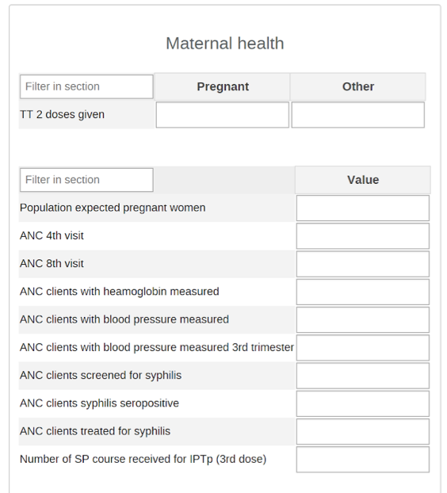
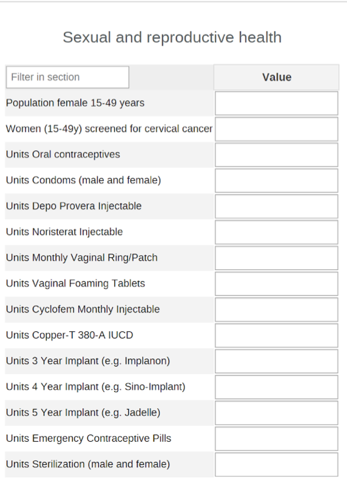
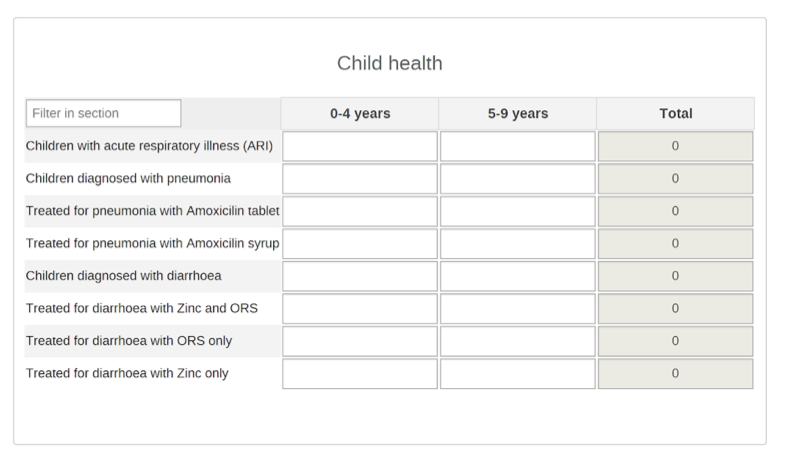
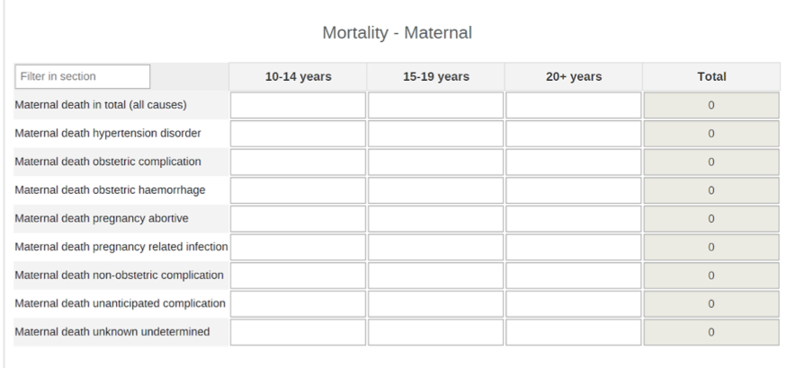
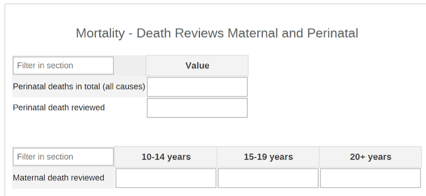
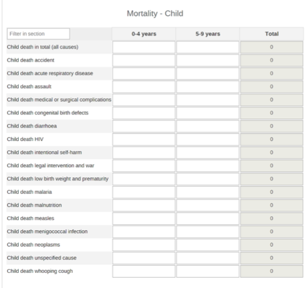
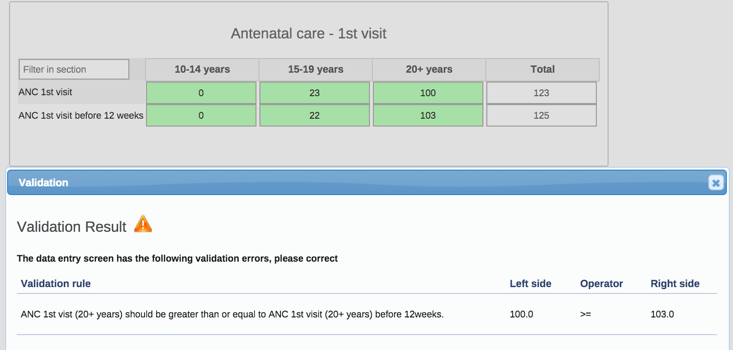

# RMNCAH Digital Data Package Aggregate System Design

Last updated April 30, 2020
DHIS2 Version compatibility: 2.30 - 2.34
Demo: [https://who-demos.dhis2.org/demo](https://who-demos.dhis2.org/demo)

## Introduction
This document describes the conceptual system design in DHIS2 for the Reproductive, Maternal, Newborn, Child and Adolescent Health (RMNCAH) configuration package for aggregate reporting. The package is designed to facilitate the capture and analysis of a core set of indicators through routine health management information systems (HMIS) as described in the [WHO Analysis and Use of Health Facility Data Guidance for RMNCAH Programme Managers](https://www.who.int/healthinfo/FacilityAnalysisGuidance_RMNCAH.pdf?ua=1) (last updated October 2019).

The RMNCAH package includes two main components:
1. Aggregate data reporting component (data set, data elements, category combinations for required disaggregation, etc).
2. Dashboard component: focusing on how the data collection part of the configuration has been designed in DHIS2 (i.e. data sets and data elements).

This document is intended for use by DHIS2 implementers at country and regional level to be able to support implementation and localisation of the configuration package while adhering to the design principles set forth.

## Overview
The RMNCAH configuration package for aggregate reporting contains the following datasets for entering input data:

| **Name** | **Periodicity** | **Purpose** |
| --- | --- | --- |
| RMNCAH | Monthly | Reporting of health facility data related to reproductive, maternal, newborn, child and adolescent health |

## Data set structure and design
This section will present the main sections (tables) of the immunisation dataset (reporting forms), explaining their configuration.

## Antenatal Care 1st Visit

- This section has been configured with data elements using a disaggregation for age (10-14 yrs, 15-19 yrs, 20+ yrs); the total is summarized automatically during data entry
- In analysis, this allows us to quickly add in the breakdown of ANC visits by age and pivot them as required.

## Maternal Health

## Delivery by Age

- Data elements contain age disaggregation; the total is summarized automatically.

## Delivery: Live &amp; Still births

- The inclusion of &#39;population live births&#39; and &#39;live births in facility&#39; provide denominators for core coverage indicators, such as PNC coverage.

## Postpartum care

- This section has been configured as individual data elements. No disaggregations are required here.

## Family planning by age &amp; sex

- This section has been configured with data elements using a disaggregation for sex (M/F) and age (10-14 yrs, 15-19 yrs, 20+ yrs); the total is summarized automatically during data entry
- In analysis, this allows us to quickly add in the breakdown of first-time family planning use by age &amp; sex and pivot them as required.

## Family planning by method

- This section enables data entry for first-time FP planning users by method; and Postpartum FP use by method

## Sexual &amp; Reproductive Health

- This section enables data entry for generating Couple Years of Protection indicator, which uses a denominator (population female 15-29 years) and units of contraception
- This section has been configured as individual data elements. No disaggregations are required here.

## Child Health

- Data elements in this section use an age disaggregation (0-4, 5-9). The total is summed automatically in data entry and can also be used in the analytics.

## Mortality: Maternal

- This section has been configured with data elements using a disaggregation for age (10-14 yrs, 15-19 yrs, 20+ yrs); the total is summarized automatically during data entry
- In analysis, this allows us to quickly add in the breakdown of maternal mortality by age and pivot them as required.

## Mortality: Death Reviews Maternal &amp; Perinatal

## Mortality: Neonatal

- This section has been configured as individual data elements. No disaggregations are required here.

## Mortality: Child

- Data elements in this section use an age disaggregation (0-4, 5-9). The total is summed automatically in data entry and can also be used in the analytics.

## Mortality: Adolescent

- This section consists of a single data element with disaggregation by sex (Male/Female) and Age (10-14, 15-19). The total is summed automatically in data entry and can also be used in the analytics.

## Data elements from other health area datasets
The following data elements are included in the WHO demo configuration, but are excluded from the RMNCAH metadata package itself.

## Validation Rules
The following validations rules have been configured and enforced in the system.
| Name | Operator | Instruction | Left Side description | Right Side description |
| --- | --- | --- | --- | --- |
| RMNCAH ANC 1st vist 10-14years \&gt;= ANC 1st visit 10-14years before 12weeks | greater\_than\_or\_equal\_to | ANC 1st visit (10-14years) should be greater than or equal to ANC 1st visit (10-14years) before 12weeks | ANC 1st Visit (10-14years) | ANC 1st visit (10-14years) before 12weeks |
| RMNCAH ANC 1st vist 15-19years \&gt;= ANC 1st visit 15-19years before 12weeks | greater\_than\_or\_equal\_to | ANC 1st visit (15-19years) should be greater than or equal to ANC 1st visit (15-19years) before 12weeks. | ANC 1st Visit (15-19years) | ANC 1st visit (15-19years) before 12weeks |
| RMNCAH ANC 1st vist 20+ years \&gt;= ANC 1st visit 20+ years before 12weeks | greater\_than\_or\_equal\_to | ANC 1st visit (20+ years) should be greater than or equal to ANC 1st visit (20+ years) before 12weeks. | ANC 1st Visit (20+ years) | ANC 1st visit (20+ years) before 12weeks |
| RMNCAH ANC 4th visit \&lt;= Total ANC 1st Visit | less\_than\_or\_equal\_to | ANC 4th visit should be less than or equal to Total ANC 1st visit | ANC 4th visit | Total ANC 1st visit |
| RMNCAH ANC 8th visit \&lt;= ANC 4th Visit | less\_than\_or\_equal\_to | ANC 8th visit should be less than or equal to ANC 4th visit | ANC 8th visit | ANC 4th visit |
| RMNCAH ANC blood pressure measured in 3rd trimester \&lt;= ANC blood pressure measured | less\_than\_or\_equal\_to | ANC blood pressure in 3rd trimester measured should be less than or equal to ANC blood pressure measured | ANC blood pressure measured in 3rd trimester | ANC blood pressure measured |
| RMNCAH ANC blood pressure measured \&lt;= Total ANC 1st Visit | less\_than\_or\_equal\_to | ANC blood pressure measured should be less than or equal to Total ANC 1st visit | ANC blood pressure measured | Total ANC 1st visit |
| RMNCAH ANC haemoglobin level measured \&lt;= Total ANC 1st Visit | less\_than\_or\_equal\_to | ANC haemoglobin level measured should be less than or equal to Total ANC 1st visit | ANC haemoglobin level measured | Total ANC 1st visit |
| RMNCAH ANC screened for syphilis \&lt;= Total ANC 1st Visit | less\_than\_or\_equal\_to | ANC screened for syphilis should be less than or equal to Total ANC 1st visit | ANC screened for syphilis | Total ANC 1st visit |
| RMNCAH ANC syphilis seropositive \&lt;= ANC screened for syphilis | less\_than\_or\_equal\_to | ANC syphilis seropositive should be less than or equal to ANC screened for syphilis | ANC syphilis seropositive | ANC screened for syphilis |
| RMNCAH ANC treated for syphilis \&lt;= ANC syphilis seropositive | less\_than\_or\_equal\_to | ANC treated for syphilis should be less than or equal to ANC syphilis seropositive | ANC treated for syphilis | ANC syphilis seropositive |
| RMNCAH Child 0-4 with acute respiratory illness (ARI)\&gt;= child 0-4 with pneumonia | greater\_than\_or\_equal\_to | Child Health: Child 0-4 with acute respiratory illness (ARI) should be greater than or equal to Child 0-4 diagnosed with pneumonia. All numbers can be zeros | Child 0-4 diagnosed with acute respiratory illness (ARI) | Child 0-4 diagnosed with pneumonia |
| RMNCAH Child 0-4 with diarrhoea \&gt;= sum of child 0-4 treatments for diarrhoea | greater\_than\_or\_equal\_to | Child Health: Child 0-4 with diarrhea should be greater than or equal to sum of child 0-4 treatments for diarrhea (Zinc, ORS, ORS +Zinc). All numbers can be zeros | Child 0-4 with diarrhea | Sum of child 0-4 diarrhea treatments: ORS, Zinz, ORS + Zinc |
| RMNCAH Child 0-4 with pneumonia \&gt;= sum of child 0-4 Amoxicilin treatments for pneumonia | greater\_than\_or\_equal\_to | Child Health: Child 0-4 with pneumonia should be greater than or equal to sum of child 0-4 Amoxicilin treatments for pneumonia (dispersed tablet, oral syrup). All numbers can be zeros | Child 0-4 diagnosed with pneumonia | Sum of child 0-4 pneumonia Amoxicilin treatments: dispersed tablet, oral syrup |
| RMNCAH Child 0-4 with pneumonia \&gt;= sum of child 0-4 treatments for pneumonia | greater\_than\_or\_equal\_to | Child Health: Child 0-4 with pneumonia should be greater than or equal to sum of child 0-4 treatments for pneumonia (Amoxicilin, other antibiotic, other medication). All numbers can be zeros | Child 0-4 diagnosed with pneumonia | Sum of child 0-4 pneumonia treatments: Amoxicilin, other antibiotic, other medication |
| RMNCAH Child 5-9 with acute respiratory illness (ARI)\&gt;= child 5-9 with pneumonia | greater\_than\_or\_equal\_to | Child Health: Child 5-9 with acute respiratory illness (ARI) should be greater than or equal to Child 5-9 diagnosed with pneumonia. All numbers can be zeros | Child 5-9 diagnosed with acute respiratory illness (ARI) | Child 5-9 diagnosed with pneumonia |
| RMNCAH Child 5-9 with diarrhoea \&gt;= sum of child 5-9 treatments for diarrhoea | greater\_than\_or\_equal\_to | Child Health: Child 5-9 with diarrhoea should be greater than or equal to sum of child 5-9 treatments for diarrhoea (Zinc, ORS, ORS +Zinc). All numbers can be zeros | Child 5-9 with diarrhoea | Sum of child 5-9 diarrhoea treatments: ORS, Zinz, ORS + Zinc |
| RMNCAH Child 5-9 with pneumonia \&gt;= sum of child 5-9 Amoxicilin treatments for pneumonia | greater\_than\_or\_equal\_to | Child Health: Child 5-9 with pneumonia should be greater than or equal to sum of child 5-9 Amoxicilin treatments for pneumonia (dispersed tablet, oral syrup). All numbers can be zeros | Child 5-9 diagnosed with pneumonia | Sum of child 5-9 pneumonia Amoxicilin treatments: dispersed tablet, oral syrup |
| RMNCAH Child 5-9 with pneumonia \&gt;= sum of child 5-9 treatments for pneumonia | greater\_than\_or\_equal\_to | Child Health: Child 5-9 with pneumonia should be greater than or equal to sum of child 5-9 treatments for pneumonia (Amoxicilin, other antibiotic, other medication). All numbers can be zeros | Child 5-9 diagnosed with pneumonia | Sum of child 5-9 pneumonia treatments: Amoxicilin, other antibiotic, other medication |
| RMNCAH Child death all causes (0-4years) = sum of child death causes (0-4years) | equal\_to | Child mortality: death all causes (0-4years) should be equal to the sum of child death causes (0-4years) | Child death all causes (0-4years) | Sum of child death causes (0-4years) |
| RMNCAH Child death all causes (5-9years) = sum of child death causes (5-9years) | equal\_to | Child mortality: death all causes (5-9years) should be equal to the sum of child death causes (5-9years) | Child death all causes (5-9years) | Sum of child death causes (5-9years) |
| RMNCAH Delivery in facility = sum of delivery by type (normal, assisted, CS) | equal\_to | Total Delivery in facility should be equal to sum of Delivery by type (normal, assisted, CS) | Total Delivery in facility | Sum of delivery by type |
| RMNCAH Live births with documented weight \&lt;= Live births | less\_than\_or\_equal\_to | Delivery: Live births with documented weight should be less than or equal to Live births | Live births with documented birth weight | Live births in facility |
| RMNCAH Maternal death all causes (10-14years) = sum of maternal death causes (10-14years) | equal\_to | Maternal mortality: death all causes (10-14years) should be equal to the sum of maternal death causes (10-14years) | Maternal death all causes (10-14years) | Sum of maternal death causes (10-14years) |
| RMNCAH Maternal death all causes (15-19years) = sum of maternal death causes (15-19years) | equal\_to | Maternal mortality: death all causes (15-19years) should be equal to the sum of maternal death causes (15-19years) | Maternal death all causes (15-19years) | Sum of maternal death causes (15-19years) |
| RMNCAH Maternal death all causes (20+ years) = sum of maternal death causes (20+ years) | equal\_to | Maternal mortality: death all causes (20+ years) should be equal to the sum of maternal death causes (20+ years) | Maternal death all causes (20+ years) | Sum of maternal death causes (20+ years) |
| RMNCAH Maternal death all causes \&gt;= maternal death audited | greater\_than\_or\_equal\_to | Maternal death all causes should be greater than or equal to maternal death audited. All numbers can be zeros | Maternal death all causes | Maternal death audited |
| RMNCAH Neonatal death all causes = sum of individual neonatal death causes | equal\_to | RMNCAH Neonatal death all causes should be or equal to sum of the separate neonatal death causes. All numbers can be zero | Neonatal death all causes | Sum of neonatal death causes |
| RMNCAH Newborn with Timely 1st PNC Visit \&lt;= newborn with at least 1 PNC visit | less\_than\_or\_equal\_to | Number of Newborns with timely 1st PNC Visits should be less than or equal to number of newborns with at least 1 PNC visit | Newborns with timely 1st PNC visit | Newborns with at least 1 PNC visit |
| RMNCAH Perinatal mortality death audited \&lt;= all perinatal death | less\_than\_or\_equal\_to | Perinatal mortality death audited should be less than or equal to Perinatal deaths in facility. Both numbers can be zero | Perinatal death audited | All perinatal deaths in facility |
| RMNCAH Population estimated Live births \&lt;= Population Expected pregnant women | less\_than\_or\_equal\_to | Delivery: Population estimated live births should be less than or equal to Expected number of pregnant women | Population estimated live births | Population expected pregnant women |
| RMNCAH Postpartum woman Timely 1st PNC Visit \&lt;= client with at least 1 PNC visit | less\_than\_or\_equal\_to | Number of Postpartum women with timely 1st PNC Visits should be less than or equal to number of Postpartum women with at least 1 PNC visit | Postpartum woman with timely 1st PNC visit | Postpartum women with at least 1 PNC visit |
| RMNCAH Sum of women initiating contraception before discharge (by method) \&lt;= total facility deliveries (by age) | less\_than\_or\_equal\_to | FP by Method: Sum of Women initiating contraception before discharge (by method) should be less than or equal to Total facility deliveries (by age) | Sum of women initiating contraception by method | Total facility deliveries |
| RMNCAH Total Contraception first time user (by age and sex) = Total Contraception first time user (by method) | equal\_to | Total Contraception first time user (by age and sex) should be equal to Total Contraception first time user (by method) | Total Contraception first time user (by age and sex) | Total Contraception first time user (by method) |
| RMNCAH Total deliveries \&lt;= Live births + still births | less\_than\_or\_equal\_to | Total facility deliveries should be less than or equal to Live births + still births (fresh + macerated) | Total facility deliveries | Sum of live births and still births |
| RMNCAH Total women initiating contraception before discharge (by age) \&lt;= total facility deliveries (by age) | less\_than\_or\_equal\_to | Total Women initiating contraception before discharge (by age) should be less than or equal to Total facility deliveries (by age) | Total women initiating contraception before discharge (by age) | Total facility deliveries (by age) |
| RMNCAH Total women initiating contraception before discharge (by age) = Total women initiating contraception before discharge (by method) | equal\_to | Total Women initiating contraception before discharge (by age) should be equal to Total women initiating contraception before discharge (by method) | Total women initiating contraception before discharge (by age) | Total women initiating contraception before discharge (by method) |
| RMNCAH Total women initiating contraception before discharge (by method) \&lt;= total facility deliveries (by age) | less\_than\_or\_equal\_to | Total Women initiating contraception before discharge (by method) should be less than or equal to Total facility deliveries (by age) | Total women initiating contraception before discharge (by method) | Total facility deliveries (by age) |
| RMNCAH Women 15-49y screened for cervical cancer \&lt;= Estimated women 15-49y | less\_than\_or\_equal\_to | Women 15-49y screened for cervical cancer should be less than or equal to Estimated number of women 15-49y | Women 15-49y screened for cervical cancer | Estimated number of women 15-49years |
| RMNCAH Women received prophylatic uterotonic immediately after birth \&lt;= total facility deliveries (by age) | less\_than\_or\_equal\_to | Women received prophylatic uterotonic immediately after birth should be less than or equal to Total facility deliveries (by age) | Received uterotonic | Total facility deliveries(by age) |

All these validation rules have been created, they can be enforced in the system and run once all the data has been captured. A typical example is the validation rule for _ANC 1st visit (20+ years)_against _ANC 1st visit before 12 weeks (20+ years)._

Essentially, we cannot report _ANC 1st visit (20+ years) before 12 weeks_ more than _ANC 1st visit (20+ years)_. Here ANC 1st visit (20+years) before 12 weeks=103 and ANC 1st visit (20+years)=100 and therefore we see a violation flagged. 

This can be easily corrected for erroneous entries and the validation is passed otherwise, this violation will be logged in the system for future validation rule analysis. Depending on the dataset configuration, form completion can be disallowed until all the validations failures are addressed. This same logic should apply to all these rules if they are enforced in the system.

## RMNCAH Outputs

The RMNCAH outputs included in the aggregate package include:
- Indicators
  - Aligned to core indicator list contained in WHO Health Facility Data Analysis Guide for RMNCAH Programme Managers
- Analytical outputs
  - Charts
  - Pivot Tables
  - Maps
- Dashboard
  - Aligned to Figures 4-18 in WHO Health Facility Data Analysis Guide for RMNCAH Programme Managers, which provides example data visualizations and interpretation guidance

## Dashboard
Dashboard items (charts and pivot table) are aligned to the WHO [Analysis and Use of Health Facility Data Guidance for RMNCAH Programme Managers](https://www.who.int/healthinfo/FacilityAnalysisGuidance_RMNCAH.pdf?ua=1).

## Indicators
RMNCAH-specific indicators contain the prefix &#39;RMNCAH&#39;. Some indicators used by RMNCAH programme managers for analysis are captured by other health programmes, such as malaria, HIV or immunisation. In these cases, the indicators retain the prefix from the vertical health program that generally captured the indicator. For example, immunisation coverage is &#39;borrowed&#39; from the EPI programme package and indicators that are part of the core RMNCAH indicator list retain their &#39;EPI&#39; prefixes:

All Core Facility Indicators included in the WHO [Analysis and Use of Health Facility Data Guidance for RMNCAH Programme Managers](https://www.who.int/healthinfo/FacilityAnalysisGuidance_RMNCAH.pdf?ua=1) are included in an Indicator Group with the dashboard package, even those that are not necessarily represented in the dashboard. This allows data users of the dashboard package to carry out additional analysis in DHIS2, such as referencing other indicators when investigating issues or questions that arise out of reviewing the dashboard.

### Indicator Groups
The following indicator groups have been configured as part of the package:
- RMNCAH: includes _all_ RMNCAH indicators configured for the package
- RMNCAH - Childhood and Young Adolescence
- RMNCAH - Maternal and Newborn Health: includes indicators related to ANC, delivery, stillbirth, etc.
- RMNCAH - Mortality: includes indicators related to adolescent, child, neonatal, and maternal deaths
- RMNCAH - Postnatal: includes indicators related to PNC visits for mother, child, and documented birthweight
- RMNCAH - Sexual and reproductive health: includes indicators related to contraception use, postpartum care, couple year protection, and cervical cancer screening coverage

A detailed overview of these items, including their names and descriptions, can be found in the metadata reference guide.

## References
1. [WHO Analysis and Use of Health Facility Data Guidance for RMNCAH Programme Managers](https://www.who.int/healthinfo/FacilityAnalysisGuidance_RMNCAH.pdf?ua=1) (October 2019)
2. WHO toolkit for analysis and use of health facility data, accessed at: [https://www.who.int/healthinfo/tools\_data\_analysis\_routine\_facility/en/](https://www.who.int/healthinfo/tools_data_analysis_routine_facility/en/)

## Acknowledgements
The WHO RMNCAH digital data package for DHIS2 was designed in collaboration with the World Health Organisation, UNICEF, Norwegian Institute of Public Health and University of Oslo Health Information Systems Programme.